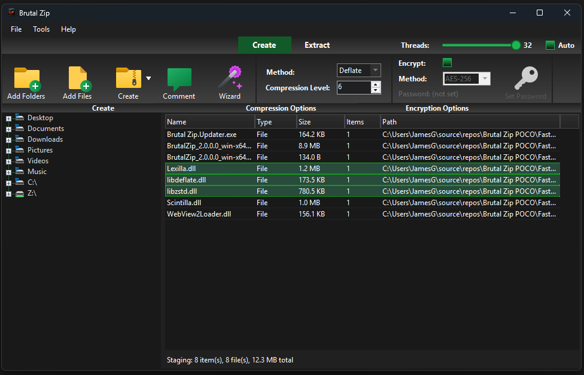

# Brutal Zip

<p align="center">
  
</p>

A blazing‑fast Windows ZIP utility focused on throughput and a smooth workflow.  
On multi‑core systems Brutal Zip typically creates ZIPs 3–15× faster than WinRAR/7‑Zip (zipping), and decompression is also significantly faster than the competitors.

> Built for Windows 10/11 (x64), .NET 8 Desktop Runtime. Portable, no installation required.  
> Optional Explorer context‑menu integration and a guided Wizard for Create/Extract.

---

## Table of Contents

- [Why Brutal Zip](#why-brutal-zip)
- [Features](#features)
- [Download](#download)
- [Quick Start](#quick-start)
- [Explorer Integration](#explorer-integration)
- [Command Line](#command-line)
- [Repair & Diagnostics](#repair--diagnostics)
- [SFX Builder](#sfx-builder)
- [Performance Tips](#performance-tips)
- [Troubleshooting](#troubleshooting)
- [Build From Source](#build-from-source)
- [Contributing](#contributing)
- [License](#license)

---

## Why Brutal Zip

- 3–15× faster ZIP creation on multi‑core CPUs (varies with CPU, storage, and data).  
- Decompression also significantly faster than classic tools.  
- Live thread control (change concurrency while running).  
- Detailed progress (MB/s, files/s, ETA), modern dark UI, and a powerful Preview & Info pane.  
- Explorer shell integration for “one‑click” Create/Extract/Test/Repair.  
- Built‑in repair tools and a visual diagnostic viewer for tricky archives.  
- Self‑extracting EXE builder with branding, license, and silent/elevation options.

---

## Features

- Compression
  - Methods: Deflate, Zstd, Store.
  - Levels: 0–12 (method‑appropriate).
  - Per‑type compression policy (e.g., “Store” or “Probe” for .png/.mp4/.zip, etc.).
  - AES‑128/192/256 and ZipCrypto encryption.
  - Create, Create to…, Create each, Create to Desktop; drag‑and‑drop into the app.
  - Live concurrency slider with Auto mode.

- Extraction
  - Extract Here, Extract (Smart → “ArchiveName/”), Choose Folder, Extract each.
  - Handles encrypted archives (minimal, smart password prompts).
  - Drag files out of the viewer to Explorer (auto‑extracts to temp as needed).

- UI & Workflow
  - Wizard for guided Create/Extract (method, level, encryption, threads).
  - Viewer with virtualized list, breadcrumbs, search, rename/move/delete inside the archive, recent list, and export (CSV/JSON).
  - Preview Pane: images, media (WebView2), text, code (syntax highlighting), and hex view.
  - Info Pane: size, ratio, method, timestamps, attributes, CRC per entry.

- Archive Info
  - Before/after ratio bars, encryption counts, date ranges, largest files, algorithm mix.
  - Whole‑archive hashes: CRC32/MD5/SHA‑256.

- Repair & Diagnostics
  - Test archive (multi‑threaded).
  - Repair central directory; salvage to a new archive.
  - Diagnostic viewer with a visual byte map of the ZIP (overlaps/mismatches, selection sync, raw extract).

- SFX Builder
  - Build self‑extracting EXEs from a ZIP.
  - Options: silent/overwrite, run after extract, elevation (UAC), “completed” dialog.
  - Branding: banner image, theme colors, optional license and “require accept”.

- Explorer Integration (optional)
  - Cascaded right‑click menus for Files, Directories, Directory Background, and `.zip` files.
  - Includes: Compress, Compress to…, Compress each, Open in app, Extract Here, Extract (Smart), Extract All to…, Extract each, Extract to Desktop, Test, Repair, Comment, Build SFX.

---

## Download

- Grab the latest portable build from the [Releases](https://github.com/jgric2/Brutal-Zip-Release/releases) page and run `BrutalZip.exe`.
- Optional: install the Explorer context menu in Settings (see below).

> Requirements  
> - Windows 10/11 (x64)  
> - .NET 8 Desktop Runtime (if not bundled)  
> - WebView2 Runtime (optional; enables media preview)

---

## Quick Start

- Create a ZIP:
  - Launch Brutal Zip → “Wizard” → add files/folders → choose method/level → Start.
  - Or drag files/folders into the app and click “Create”.
  - Or right‑click in Explorer → Brutal Zip → “Compress using Brutal Zip”.

- Extract a ZIP:
  - Double‑click `.zip` to open it in Brutal Zip → “Extract”.
  - Or right‑click `.zip` in Explorer → Brutal Zip → “Extract Here” / “Extract (Smart)” / “Choose folder…”.

- Preview & Info:
  - Select entries in the viewer to see images/media/text/code/hex previews and per‑entry info on the right.

- Repair:
  - Right‑click `.zip` → Brutal Zip → “Repair archive” or open the Diagnostic Viewer from the toolbar.

---

## Explorer Integration

1. Open Brutal Zip → Settings → enable “Add to Explorer context menu”.
2. This writes to HKCU (per‑user). When run elevated, HKLM can be written as well.  
3. To remove, uncheck the option in Settings; Explorer will refresh automatically.

---

## Command Line

```
--stage
--create-quick | --create-to | --create-each | --create-to-desktop
--create-store | --create-aes
--extract-here | --extract-smart | --extract-to | --extract-each | --extract-to-desktop
--test | --repair | --comment | --sfx | --wizard | --export-list
```

Examples:
```bat
BrutalZip.exe --create-quick "C:\Data\Project"
BrutalZip.exe --create-to "C:\Out\Project.zip" "C:\Data\Project"
BrutalZip.exe --extract-smart "C:\Downloads\archive.zip"
BrutalZip.exe --test "C:\Downloads\archive.zip"
BrutalZip.exe --wizard
```

Legacy flags: `-c`, `-x`, `-xh`, `-xto`

---

## Repair & Diagnostics

- Test: multi‑threaded integrity check with accurate progress and MB/s / files/s.
- Repair Central Directory: fix missing/shifted CD where possible.
- Salvage: copy recoverable entries to a new archive.
- Diagnostic Viewer: visual map of the entire ZIP, overlaps/mismatches, selection syncing, raw extract, and quick navigate.

---

## SFX Builder

- Build a branded self‑extracting `.exe` from a ZIP.
- Options: silent mode, overwrite policy, run after extract, elevation (UAC), and “completed” dialog.
- Branding: banner image, theme colors, optional license text and “Require acceptance”.

---

## Performance Tips

- Use “Auto” threads or tune manually in the toolbar/Settings.
- Prefer “Store” for already‑compressed data (images/video/zips) via “Per‑type rules” in Settings.
- Keep source/target on fast storage (NVMe/SSD) for best results.
- Zstd provides great speed/ratio trade‑offs on many datasets.

> On modern multi‑core systems, Brutal Zip typically creates ZIPs 3–15× faster than WinRAR/7‑Zip (zipping), and decompression is also significantly faster. Results vary with data, CPU, and storage.

---

## Troubleshooting

- Media preview requires the WebView2 Runtime. If missing, Brutal Zip falls back to “Open”.
- If Explorer context menu doesn’t appear, toggle the option in Settings (and/or run Brutal Zip elevated to write HKLM).
- Encrypted archives:
  - A minimal password prompt appears once and is validated efficiently.
  - “Crack Password” tooling is experimental—use responsibly.

---

## Contributing

Issues and feedback are welcome:
- Performance results (dataset type/size, CPU/RAM/storage, method/level).
- Bug reports (steps to reproduce, logs/stack traces).
- Feature requests and UI/UX feedback.

Please keep “Crack Password”‑related proposals responsible and lawful.

---

> If you like Brutal Zip, please star the repo and share your benchmarks. Your feedback helps guide the next milestones (e.g., additional formats, more preview types, and deeper diagnostics).
